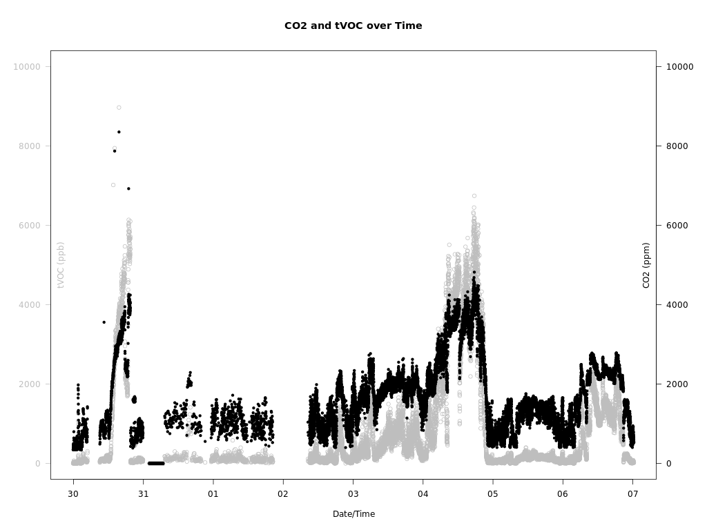
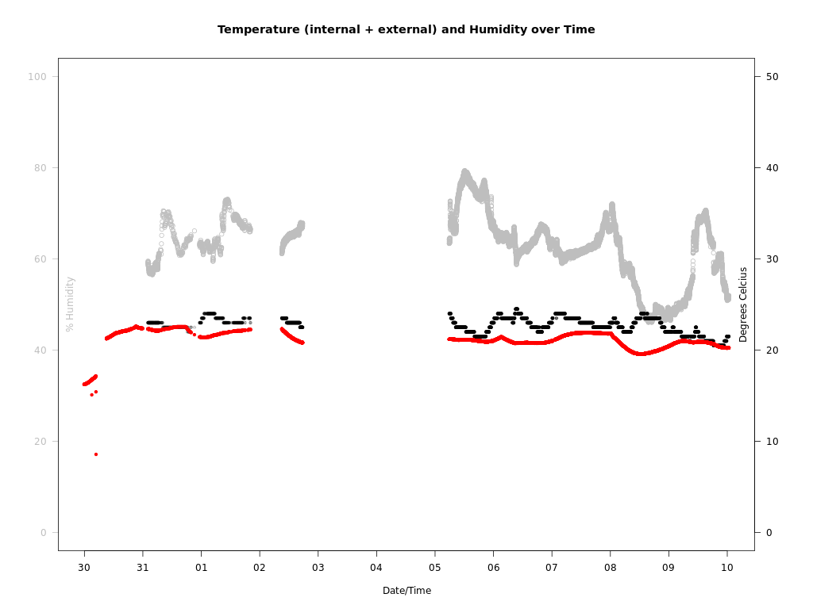

# packages

r-cran

# services
```
 sudo cp *.service /etc/systemd/system/
 systemctl enable ccs811.service http.service 
```

# cron
```
# m h  dom mon dow   command
*/30 * * * * cd /home/ubuntu && ./ccs811.sh >/dev/null 2>&1
```

# testing
* readTemp.py to check if the 1-wire temperature probe is working
* testRowi.py to check that Rowi is working




