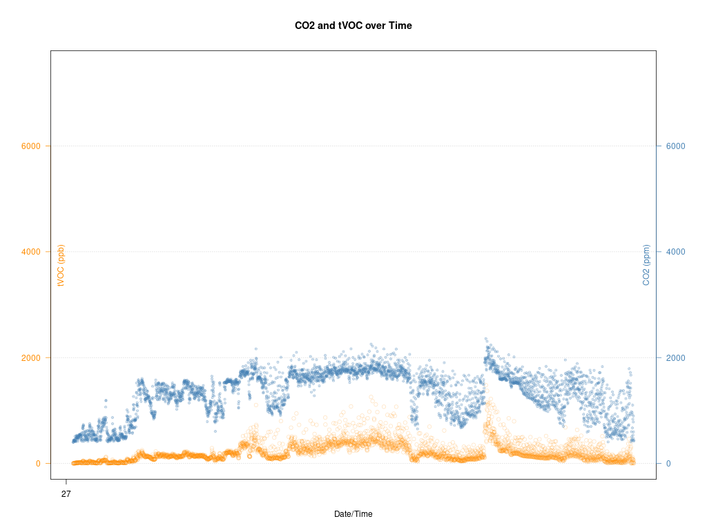

# What / why?

Set-up to monitor my brew fermentation (over a ~10 day period) to watch for co2 levels to drop to indicate the brew is done.

Also have a Rowi (API enabled plug) to turn on my heater belt if the temp drops low.

Currently a WIP - will improve and add some 3d print files for the housing ( fits on top of the airlock).

# hardware

* pi-zero 2w
* ccs811 - air quality sensor (sparkfun)
* DS18b20 - Temperature Sensor Probe - Stainless steel
* rowi 2
* Mangrove Jack starter brew kit
* Thermowell 300mm - cut to suit

## /boot/firmware/config.txt

```
# Uncomment some or all of these to enable the optional hardware interfaces
dtparam=i2c_arm=on
dtparam=i2s=on
dtparam=spi=on

# Enable I2C clock stretching
dtparam=i2c_arm_baudrate=10000

...

dtoverlay=w1-gpio
enable_uart=1
```


# packages

- git 
- r-recommended
- r-cran-zoo
- python3-pip

## python packages

- pip3 install sparkfun-qwiic-i2c

# services
```
 sudo cp *.service /etc/systemd/system/
 systemctl enable fermmon.service http.service 
```

# cron
```
# m h  dom mon dow   command
*/30 * * * * cd /home/ubuntu/fermmon && ./fermmon.sh >/dev/null 2>&1
```

# testing
* readTemp.py to check if the 1-wire temperature probe is working
* testRowi.py to check that Rowi is working





# references

* https://www.sparkfun.com/sparkfun-environmental-combo-breakout-ens160-bme280-qwiic.html
* https://surplustronics.co.nz/products/7361-temperature-sensor-probe-ds18b20-stainless-steel?srsltid=AfmBOoqpXowka8xFb00-9X7AfwTPzsrlTYhQia4CZAeGhiJS74ml-dqN
* https://www.kiwi-warmer.co.nz/shop/product/826130/rowi-2-smart-plug-with-api/
* https://mangrovejacks.com/collections/starter-brewery/products/traditional-series-blonde-lager-starter-brewery
* https://allthingsfermented.nz/products/ss-brewtech-stainless-steel-weldless-thermowell
